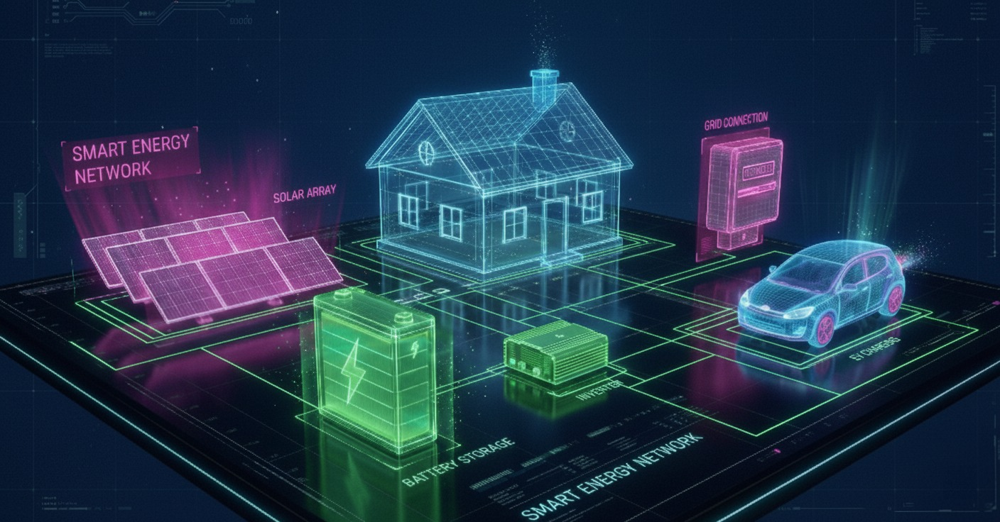

# Lumina Energy Card

[](https://github.com/custom-components/hacs)


Limuna Energy Card repository is <https://github.com/ratava/lumina-energy-card>.



[](https://www.paypal.me/giorgiosalierno)


**Language / Lingua / Sprache / Langue:** [English](#english) | [Italiano](#italiano) | [Deutsch](#deutsch) | [Français](#fran%C3%A7ais)

---

## Quick Install (Custom HACS Repository)

1. Open HACS in Home Assistant and choose **Frontend**.
1. Click the three-dot menu and select **Custom repositories**.
1. Paste `https://github.com/ratava/lumina-energy-card`, set the category to **Frontend**, and click **Add**.
1. Close the dialog, locate **Lumina Energy Card** in the Frontend list, and install it.
1. Restart Home Assistant if requested, then add the card from the Lovelace visual editor.

---

## English

### Overview (EN)

Lumina Energy Card is a Home Assistant custom Lovelace card that renders animated energy flows, aggregates PV strings and batteries, and surfaces optional EV charging metrics in a cinematic layout.

### Key Features (EN)

- Up to six PV sensors with smart per-string or totalised labels
- Up to four battery systems with SOC averaging and liquid-fill battery visualisation
- Animated grid, load, PV, battery and EV flows with dynamic colour, speed, and selectable dash/dot/arrow styles
- Configurable grid animation threshold (default 100 W) to suppress low-level import/export chatter
- Adjustable animation speed multiplier (-3x to 3x, default 1x, pause/reverse supported) and per-flow visibility thresholds
- Optional EV panel with power and SOC display, configurable colour, and typography
- Daily production badge plus full typography controls for header, PV, battery, load, grid, and EV text
- Load warning/critical colour overrides and a configurable low SOC threshold for the battery liquid fill
- Update interval slider (0–60 s, default 30 s) with optional real-time refresh when set to 0

### Installation (EN)

#### HACS (EN)

1. Open HACS in Home Assistant and choose **Frontend**.
1. Use the three-dot menu → **Custom repositories**.
1. Enter `https://github.com/ratava/lumina-energy-card`, pick **Frontend**, and click **Add**.
1. Locate **Lumina Energy Card** under Frontend and click **Install**.
1. Restart Home Assistant if prompted.

#### Manual Installation (EN)

1. Download `dist/lumina-energy-card.js` from the [latest release](https://github.com/ratava/lumina-energy-card/releases).
1. Copy the file to `/config/www/community/lumina-energy-card/`.
1. Place `dist/lumina_background.jpg` in the same directory.
1. Add the Lovelace resource:

```yaml
lovelace:
  resources:
    - url: /local/community/lumina-energy-card/lumina-energy-card.js
      type: module
```

1. Restart Home Assistant to load the resource.

### Configuration (EN)

1. Edit your dashboard and click **Add Card**.
1. Search for **Lumina Energy Card**.
1. Fill in the fields using the entity pickers and switches.
1. Adjust the **Update Interval** slider to control refresh cadence.

Minimal YAML example:

```yaml
type: custom:lumina-energy-card
sensor_pv1: sensor.solar_production
sensor_daily: sensor.daily_production
sensor_bat1_soc: sensor.battery_soc
sensor_bat1_power: sensor.battery_power
sensor_home_load: sensor.home_consumption
sensor_grid_power: sensor.grid_power
background_image: /local/community/lumina-energy-card/lumina_background.jpg
```

### Options (EN)

| Option | Type | Default | Notes |
| --- | --- | --- | --- |
| `card_title` | string | `LUMINA ENERGY` | Optional header text |
| `background_image` | string | `/local/community/lumina-energy-card/lumina_background.jpg` | Background asset path |
| `language` | string | `en` | Accepts `en`, `it`, or `de` |
| `display_unit` | string | `kW` | Display values in `W` or `kW` |
| `update_interval` | number | `30` | Refresh cadence (0–60, step 5; 0 disables throttling) |
| `animation_speed_factor` | number | `1` | Flow animation multiplier (-3–3, 0 pauses, negatives reverse) |
| `animation_style` | string | `dashes` | Flow animation motif (`dashes`, `dots`, `arrows`) |
| `header_font_size` | number | `16` | Typography for the header (12–32 px) |
| `pv_font_size` | number | `16` | Typography for PV text (12–28 px) |
| `battery_soc_font_size` | number | `20` | Typography for SOC label (12–32 px) |
| `battery_power_font_size` | number | `14` | Typography for battery power (10–28 px) |
| `load_font_size` | number | `15` | Typography for load label (10–28 px) |
| `grid_font_size` | number | `15` | Typography for grid label (10–28 px) |
| `car_power_font_size` | number | `15` | Typography for EV power (10–28 px) |
| `car_soc_font_size` | number | `12` | Typography for EV SOC (8–24 px) |
| `daily_label_font_size` | number | `12` | Typography for the daily label (8–24 px) |
| `daily_value_font_size` | number | `20` | Typography for the daily total (12–32 px) |
| `sensor_pv_total` | entity | — | Optional aggregate PV production sensor |
| `show_pv_strings` | boolean | `false` | Display combined total plus each PV string |
| `sensor_pv1` | entity | — | Primary PV sensor (required) |
| `sensor_daily` | entity | — | Daily production sensor (required) |
| `sensor_bat1_soc` | entity | — | Battery SOC sensor (required) |
| `sensor_bat1_power` | entity | — | Battery power sensor (required) |
| `sensor_home_load` | entity | — | Home load sensor (required) |
| `sensor_grid_power` | entity | — | Grid import/export sensor (required) |
| `sensor_grid_import` | entity | — | Optional import-only sensor (positive values) |
| `sensor_grid_export` | entity | — | Optional export-only sensor (positive values) |
| `pv_primary_color` | string | `#0080ff` | PV 1 flow animation colour |
| `pv_secondary_color` | string | `#80ffff` | PV 2 flow animation colour |
| `load_flow_color` | string | `#0080ff` | Home load flow animation colour |
| `load_threshold_warning` | number | — | Load warning threshold (W or kW based on display unit) |
| `load_warning_color` | string | `#ff8000` | Load warning colour (orange) |
| `load_threshold_critical` | number | — | Load critical threshold (W or kW based on display unit) |
| `load_critical_color` | string | `#ff0000` | Load critical colour (red) |
| `battery_charge_color` | string | `#00FFFF` | Battery charge flow colour (cyan) |
| `battery_discharge_color` | string | `#FFFFFF` | Battery discharge flow colour (white) |
| `grid_import_color` | string | `#FF3333` | Grid import flow colour (red) |
| `grid_export_color` | string | `#00ff00` | Grid export flow colour (green) |
| `car_flow_color` | string | `#00FFFF` | EV flow animation colour (cyan) |
| `battery_fill_high_color` | string | `#00ffff` | Battery liquid fill colour when SOC is above low threshold (cyan) |
| `battery_fill_low_color` | string | `#ff0000` | Battery liquid fill colour when SOC is at or below low threshold (red) |
| `battery_fill_low_threshold` | number | `25` | SOC percentage where the battery liquid switches to the low colour |
| `grid_activity_threshold` | number | `100` | Minimum absolute grid power (W) before grid flow animates |
| `grid_threshold_warning` | number | — | Trigger warning colour when grid magnitude meets this value (W or kW) |
| `grid_warning_color` | string | `#ff8000` | Grid warning colour (orange) |
| `grid_threshold_critical` | number | — | Trigger critical colour when magnitude meets this value (W or kW) |
| `grid_critical_color` | string | `#ff0000` | Grid critical colour (red) |
| `invert_grid` | boolean | `false` | Flip grid sign if needed |
| `sensor_car_power` | entity | — | Optional EV charging power |
| `sensor_car_soc` | entity | — | Optional EV SOC sensor |
| `show_car_soc` | boolean | `false` | Show Electric Vehicle panel (power and SOC) |
| `car_pct_color` | string | `#00FFFF` | EV SOC text colour |
| `sensor_pv_total_secondary` | entity | — | Optional second inverter total sensor (PV2) |
| `sensor_pv_array2_1` | entity | — | PV String 1 (Array 2) |
| `sensor_pv_array2_2` | entity | — | PV String 2 (Array 2) |
| `sensor_pv_array2_3` | entity | — | PV String 3 (Array 2) |
| `sensor_pv_array2_4` | entity | — | PV String 4 (Array 2) |
| `sensor_pv_array2_5` | entity | — | PV String 5 (Array 2) |
| `sensor_pv_array2_6` | entity | — | PV String 6 (Array 2) |
| `sensor_daily_array2` | entity | — | Daily production sensor for Array 2 (combined with `sensor_daily`) |
| `sensor_home_load_secondary` | entity | — | Optional home load sensor for inverter 2 |
| `pv_tot_color` | string | `#00FFFF` | Colour applied to the PV TOT text/line |
| `house_total_color` | string | — | Colour applied to the HOUSE TOT label/flow |
| `inv1_color` | string | `#0080ff` | Colour applied to INV 1 label/flow |
| `inv2_color` | string | `#80ffff` | Colour applied to INV 2 label/flow |
| `car_name_font_size` | number | `15` | Font size for Car name label (px) |
| `car2_name_font_size` | number | `15` | Font size for Car 2 name label (px) |

### Additional Array 2 & Options (EN)

- `sensor_pv_total_secondary` | entity | — | Optional second inverter total sensor (treated as PV2). When provided it is included in the PV TOT and used as the secondary PV flow.
- `sensor_pv_array2_1` .. `sensor_pv_array2_6` | entities | — | Up to six per-string sensors for a secondary PV array (Array 2). When `show_pv_strings` is enabled these appear as separate lines under the PV total.
- `sensor_daily_array2` | entity | — | Daily production sensor for Array 2; the card displays a combined daily yield = `sensor_daily` + `sensor_daily_array2`.
- `sensor_home_load_secondary` | entity | — | Optional home load/consumption sensor associated with inverter 2; used to compute HOUSE TOT and INV 2 values when Array 2 is configured.
- `pv_tot_color` | string | `#00FFFF` | Colour applied to the PV TOT text/line (overrides per-string inheritance when set).
- `house_total_color`, `inv1_color`, `inv2_color` | string | — | Per-line colours applied to HOUSE TOT, INV 1 and INV 2 labels/flows when Array 2 is active.
- `invert_battery` | boolean | `false` | Flip battery charge/discharge polarity (swap charge/discharge colours and reverse animation direction when enabled).
Car colours & fonts: `car1_name_color`, `car2_name_color`, `car1_color`, `car2_color`, `car2_pct_color`, `car_name_font_size`, `car2_name_font_size` — new color and name-font-size options for Car 1 and Car 2 (power and SOC font sizes remain available as `car_power_font_size`, `car2_power_font_size`, `car_soc_font_size`, `car2_soc_font_size`).

Notes:

- When Array 2 is active the PV flow mapping is: `pv1` → Array 1 (primary), `pv2` → Array 2 (secondary). The PV TOT line shows the combined production where applicable.

- Enabling `show_pv_strings` will show per-string lines for the active array(s); when Array 2 is present the card will render PV TOT / Array1 total / Array2 total and the HOUSE section will render `HOUSE TOT / INV 1 / INV 2` as separate lines.

### Ulteriori opzioni Array 2 (IT)

`sensor_pv_total_secondary` | entity | — | Sensore totale opzionale per il secondo inverter (trattato come PV2). Quando presente viene sommato al PV TOT e usato come flusso FV secondario.

`sensor_pv_array2_1` .. `sensor_pv_array2_6` | entities | — | Fino a sei sensori per stringa per un secondo array FV (Array 2). Se `show_pv_strings` è abilitato appaiono come linee separate sotto il totale PV.

`sensor_daily_array2` | entity | — | Sensore di produzione giornaliera per Array 2; la scheda mostra il totale giornaliero combinato = `sensor_daily` + `sensor_daily_array2`.

`sensor_home_load_secondary` | entity | — | Sensore opzionale di carico domestico associato all inverter 2; usato per calcolare HOUSE TOT e INV 2 quando Array 2 è configurato.

`pv_tot_color` | string | `#00FFFF` | Colore applicato alla riga/testo PV TOT (sovrascrive l ereditarieta per stringa se impostato).

`house_total_color`, `inv1_color`, `inv2_color` | string | — | Colori per riga applicati a HOUSE TOT, INV 1 e INV 2 quando Array 2 è attivo.

`invert_battery` | boolean | `false` | Inverti la polarita di carica/scarica batteria (scambia i colori e inverte la direzione dell animazione se abilitato).

Opzioni colori/font Auto: `car1_name_color`, `car2_name_color`, `car1_color`, `car2_color`, `car2_pct_color`, `car_name_font_size`, `car2_name_font_size` — nuove opzioni per colori e dimensione del nome Auto 1/2.

Note:

- Quando Array 2 è attivo il mapping dei flussi FV è: `pv1` → Array 1 (primario), `pv2` → Array 2 (secondario). La riga PV TOT mostra la produzione combinata quando disponibile.

- Abilitando `show_pv_strings` verranno mostrate le linee per stringa per gli array attivi; quando Array 2 è presente la scheda renderizzerà PV TOT / Totale Array1 / Totale Array2 e la sezione HOUSE mostrerà `HOUSE TOT / INV 1 / INV 2` come linee separate.

### Zusätzliche Array-2-Optionen (DE)

`sensor_pv_total_secondary` | entity | — | Optionaler Gesamtwertsensor für den zweiten Wechselrichter (als PV2 behandelt). Wenn vorhanden wird er in PV TOT einbezogen und als sekundärer PV-Fluss verwendet.

`sensor_pv_array2_1` .. `sensor_pv_array2_6` | entities | — | Bis zu sechs Einzelstring-Sensoren für ein zweites PV-Array (Array 2). Wenn `show_pv_strings` aktiviert ist, werden diese als separate Zeilen unter der PV-Gesamtlinie angezeigt.

`sensor_daily_array2` | entity | — | Tagesproduktionssensor für Array 2; die Karte zeigt den kombinierten Tagesertrag = `sensor_daily` + `sensor_daily_array2`.

`sensor_home_load_secondary` | entity | — | Optionaler Haushaltsverbrauchssensor, der mit Wechselrichter 2 verbunden ist; wird verwendet, um HOUSE TOT und INV 2 Werte zu berechnen, wenn Array 2 konfiguriert ist.

`pv_tot_color` | string | `#00FFFF` | Farbe für die PV TOT Text-/Linie (überschreibt die Vererbung pro String, wenn gesetzt).

`house_total_color`, `inv1_color`, `inv2_color` | string | — | Zeilenfarben für HOUSE TOT, INV 1 und INV 2, wenn Array 2 aktiv ist.

`invert_battery` | boolean | `false` | Batterie-Lade-/Entladepolarität umkehren (tauscht Lade-/Entladefarben und kehrt die Animationsrichtung um, wenn aktiviert).

Auto-Farben & Schriften: `car1_name_color`, `car2_name_color`, `car1_color`, `car2_color`, `car2_pct_color`, `car_name_font_size`, `car2_name_font_size` — neue Farb- und Namensschriftgröße-Optionen für Auto 1 und Auto 2.

Hinweise:

- Wenn Array 2 aktiv ist, gilt folgende PV-Fluss-Zuordnung: `pv1` → Array 1 (primär), `pv2` → Array 2 (sekundär). Die PV TOT Zeile zeigt die kombinierte Produktion, falls vorhanden.

- Wenn `show_pv_strings` aktiviert ist, werden pro String Zeilen für die aktiven Arrays angezeigt; wenn Array 2 vorhanden ist, rendert die Karte PV TOT / Array1 Gesamt / Array2 Gesamt und der HOUSE-Bereich rendert `HOUSE TOT / INV 1 / INV 2` als separate Zeilen.

---

## Français

### Aperçu (FR)

La carte Lumina Energy est une carte Lovelace personnalisée pour Home Assistant qui affiche des flux d'énergie animés, agrège les chaînes PV et les batteries, et peut afficher des métriques optionnelles de recharge EV dans une présentation soignée.

### Fonctionnalités clés (FR)

- Jusqu'à six capteurs PV avec étiquetage intelligent par chaîne ou totalisé
- Jusqu'à quatre systèmes de batterie avec moyenne SOC et visualisation par remplissage liquide
- Flux animés pour réseau, charge, PV, batterie et EV avec couleur dynamique et styles sélectionnables (tirets, points, flèches)
- Seuil d'animation du réseau configurable (par défaut 100 W) pour supprimer le bruit d'import/export faible
- Multiplicateur de vitesse d'animation ajustable (-3x à 3x) et contrôles de visibilité par flux
- Panneau EV optionnel avec affichage de puissance et SOC, couleurs et typographie configurables
- Badge de production quotidienne et contrôles typographiques complets
- Options pour inverser polarité batterie et personnaliser couleurs/seuils
- Support pour un deuxième onduleur / Array 2 (capteurs PV par chaîne et capteur PV total secondaire)

### Installation (FR)

#### HACS (FR)

1. Ouvrez HACS dans Home Assistant et choisissez **Frontend**.
1. Cliquez sur le menu à trois points et sélectionnez **Custom repositories**.
1. Collez `https://github.com/ratava/lumina-energy-card`, définissez la catégorie sur **Frontend**, puis cliquez sur **Add**.
1. Fermez la boîte, trouvez **Lumina Energy Card** dans la liste Frontend et installez-la.
1. Redémarrez Home Assistant si nécessaire, puis ajoutez la carte depuis l'éditeur Lovelace.

#### Installation manuelle (FR)

1. Téléchargez `dist/lumina-energy-card.js` depuis la [dernière release](https://github.com/ratava/lumina-energy-card/releases).
1. Copiez le fichier dans `/config/www/community/lumina-energy-card/`.
1. Placez `dist/lumina_background.jpg` dans le même dossier.
1. Ajoutez la ressource Lovelace :

```yaml
lovelace:
  resources:
    - url: /local/community/lumina-energy-card/lumina-energy-card.js
      type: module
```

1. Redémarrez Home Assistant pour charger la ressource.

### Configuration (FR)

1. Éditez votre tableau de bord et cliquez sur **Add Card**.
1. Recherchez **Lumina Energy Card**.
1. Remplissez les champs à l'aide des sélecteurs d'entités et des bascules.
1. Ajustez l'intervalle de mise à jour (**Update Interval**) selon vos besoins.

Exemple YAML minimal (FR) :

```yaml
type: custom:lumina-energy-card
sensor_pv1: sensor.solar_production
sensor_daily: sensor.daily_production
sensor_bat1_soc: sensor.battery_soc
sensor_bat1_power: sensor.battery_power
sensor_home_load: sensor.home_consumption
sensor_grid_power: sensor.grid_power
background_image: /local/community/lumina-energy-card/lumina_background.jpg
```

### Options (FR)

Les options disponibles correspondent à celles listées dans la section anglaise. Les champs obligatoires incluent typiquement : `sensor_pv1`, `sensor_daily`, `sensor_bat1_soc`, `sensor_bat1_power`, `sensor_home_load`, `sensor_grid_power`. Pour les autres options, référez-vous au tableau `Options (EN)` ci‑dessous.

### Options additionnelles Array 2 (FR)

- `sensor_pv_total_secondary` | entity | — | Capteur total optionnel pour le second onduleur (PV2). Lorsqu'il est fourni, il est inclus dans PV TOT et utilisé comme flux PV secondaire.
- `sensor_pv_array2_1` .. `sensor_pv_array2_6` | entities | — | Jusqu'à six capteurs par chaîne pour un second array PV (Array 2). Si `show_pv_strings` est activé, ils apparaissent comme lignes séparées.
- `sensor_daily_array2` | entity | — | Capteur production quotidienne pour Array 2 ; la carte affiche le rendement quotidien combiné = `sensor_daily` + `sensor_daily_array2`.
- `sensor_home_load_secondary` | entity | — | Capteur de charge domestique optionnel associé à l'onduleur 2 ; utilisé pour calculer HOUSE TOT et INV 2 quand Array 2 est configuré.

### Fond & Dépannage (FR)

- Fond par défaut : `/local/community/lumina-energy-card/lumina_background.jpg` (copiez votre image à côté du fichier JS pour personnaliser).
- Dimensions recommandées : 800×450 (16:9).
- Carte manquante : vérifiez que la ressource est ajoutée et videz le cache du navigateur.
- Zéros de lecture : vérifiez les IDs d'entités et la disponibilité des capteurs.
- Lenteur de l'éditeur : augmentez `update_interval` ou réduisez la fréquence de rafraîchissement du dashboard.

### Support & Licence (FR)

- Licence : MIT (voir [LICENSE](LICENSE)).
- Problèmes & demandes de fonctionnalités : soumettez via [GitHub](https://github.com/ratava/lumina-energy-card).

### Changelog (FR)

- **1.1.24 (2025-12-23)** – Ajout du support secondaire PV Array 2 (sélecteurs par chaîne et `sensor_pv_total_secondary`), rendement journalier combiné (`sensor_daily` + `sensor_daily_array2`), charge domestique secondaire (`sensor_home_load_secondary`), `pv_tot_color`, couleurs par ligne HOUSE/INV (`house_total_color`, `inv1_color`, `inv2_color`), support `invert_battery`, options de taille police nom voiture (`car_name_font_size`, `car2_name_font_size`) et mises à jour de l éditeur et du README (EN/IT/DE/FR).

---

### Background & Troubleshooting (EN)

- Default background: `/local/community/lumina-energy-card/lumina_background.jpg` (copy your image next to the JS file to customise).
- Recommended dimensions: 800×450 (16:9).
- Missing card: ensure the resource entry exists and clear browser cache.
- Zero readings: confirm entity IDs and sensor availability.
- Editor lag: increase `update_interval` or reduce dashboard refresh load.

### Support & License (EN)

- License: MIT (see [LICENSE](LICENSE)).
- Issues & feature requests: submit via [GitHub](https://github.com/ratava/lumina-energy-card).

### Changelog (EN)

- **1.1.24 (2025-12-23)** – Added secondary PV Array 2 support (per-array string selectors and `sensor_pv_total_secondary`), combined daily yield (`sensor_daily` + `sensor_daily_array2`), secondary home load (`sensor_home_load_secondary`), `pv_tot_color`, per-line HOUSE/INV colours (`house_total_color`, `inv1_color`, `inv2_color`), `invert_battery` support, new car name font-size options (`car_name_font_size`, `car2_name_font_size`) and corresponding editor schema and localized README entries (EN/IT/DE).
- **1.1.20 (2025)** – Tuned arrow animation scaling, added grid animation threshold, EV panel toggle, and documentation refresh.
- **1.1.18 (2025)** – Added selectable flow animation styles (dashes, dots, arrows) and refreshed documentation.
- **1.1.13 (2025)** – Added smooth flow duration easing with dynamic rate scaling, cleanup guards, and a 0s update interval option for real-time refresh.
- **1.1.1 (2025)** – Polished localisation text and prepped packaging for the single-file release.
- **1.1.0 (2025)** – Localised the Lovelace editor labels/helpers for English, Italian, and German while keeping the single-file distribution.
- **1.0.8 (2025)** – Converted typography controls to simple text inputs alongside EV settings for quicker edits.
- **1.0.7 (2025)** – Restored typography controls inside the new form-based editor layout.
- **1.0.5 (2025)** – Rebuilt the Lovelace editor with Home Assistant form selectors so entity pickers and sliders update config instantly.
- **1.0.4 (2025)** – Merged the editor into the main bundle, added localized configuration tabs, and moved typography controls into their own tab.
- **1.0.3 (2025)** – Added animation speed scaling, typography sliders, and inline entity examples in the editor.
- **1.0.2 (2025)** – Update to base code.
- **1.0.1 (2025)** – Moved distributable files into `dist/` and aligned manual install docs with new filenames.

---

## Italiano

### Panoramica (IT)

Lumina Energy Card è una scheda Lovelace per Home Assistant che offre grafica animata dei flussi energetici, gestione di stringhe FV multiple, batterie e monitor EV opzionale in un'unica interfaccia.

### Funzionalità Chiave (IT)

- Fino a 6 sensori fotovoltaici con etichettatura intelligente
- Fino a 4 batterie con media SOC e visualizzazione liquida 3D
- Flussi animati con colori dinamici e stili selezionabili (tratteggi, punti, frecce) per rete, casa, FV, batterie ed EV
- Soglia di attivazione configurabile per i flussi di rete (default 100 W) per nascondere import/export minimi
- Soglie avviso/emergenza import-export allineate all'unità di visualizzazione (W/kW)
- Moltiplicatore di velocità per regolare le animazioni dei flussi (-3x a 3x, default 1x, pausa/inversione)
- Pannello EV opzionale con potenza e SOC personalizzabili
- Badge produzione giornaliera, titolo, sfondo e unità configurabili
- Colori di avviso/critico per il carico e soglia SOC bassa della batteria configurabile per il riempimento
- Controlli tipografici per titolo, FV, batterie, carichi, rete ed EV
- Slider intervallo aggiornamento (0–60 s) con refresh continuo se impostato a 0

### Installazione HACS (IT)

1. Apri HACS → **Frontend**.
1. Menu a tre puntini → **Repository personalizzati**.
1. Inserisci `https://github.com/ratava/lumina-energy-card`, seleziona **Frontend** e premi **Aggiungi**.
1. Installa **Lumina Energy Card** dalla sezione Frontend.
1. Riavvia Home Assistant se richiesto.

### Installazione Manuale (IT)

1. Scarica `dist/lumina-energy-card.js` dall'[ultima release](https://github.com/ratava/lumina-energy-card/releases).
1. Copia il file in `/config/www/community/lumina-energy-card/`.
1. Copia `dist/lumina_background.jpg` nella stessa cartella.
1. Aggiungi la risorsa Lovelace come mostrato nella sezione inglese.
1. Riavvia Home Assistant.

### Configurazione Rapida (IT)

- Aggiungi la scheda tramite editor visivo e seleziona le entità con gli entity picker.
- YAML minimo:

```yaml
type: custom:lumina-energy-card
sensor_pv1: sensor.produzione_solare
sensor_daily: sensor.produzione_giornaliera
sensor_bat1_soc: sensor.batteria_soc
sensor_bat1_power: sensor.batteria_potenza
sensor_home_load: sensor.consumo_casa
sensor_grid_power: sensor.potenza_rete
background_image: /local/community/lumina-energy-card/lumina_background.jpg
```

### Suggerimenti (IT)

- Obbligatori: `sensor_pv1`, `sensor_daily`, `sensor_bat1_soc`, `sensor_bat1_power`, `sensor_home_load`, `sensor_grid_power`.
- Per uno sfondo personalizzato copia l'immagine nella stessa cartella del JS e aggiorna `background_image`.
- Imposta `invert_grid: true` se i valori di rete risultano invertiti.

### Opzioni (IT)

| Opzione | Tipo | Predefinito | Note |
| --- | --- | --- | --- |
| `sensor_pv_total_secondary` | entity | — | Sensore totale opzionale per il secondo inverter (PV2) |
| `sensor_pv_array2_1` | entity | — | PV String 1 (Array 2) |
| `sensor_pv_array2_2` | entity | — | PV String 2 (Array 2) |
| `sensor_pv_array2_3` | entity | — | PV String 3 (Array 2) |
| `sensor_pv_array2_4` | entity | — | PV String 4 (Array 2) |
| `sensor_pv_array2_5` | entity | — | PV String 5 (Array 2) |
| `sensor_pv_array2_6` | entity | — | PV String 6 (Array 2) |
| `sensor_daily_array2` | entity | — | Sensore produzione giornaliera per Array 2 (combinato con `sensor_daily`) |
| `sensor_home_load_secondary` | entity | — | Sensore carico casa opzionale per inverter 2 |
| `pv_tot_color` | string | `#00FFFF` | Colore applicato alla riga/testo PV TOT |
| `house_total_color` | string | — | Colore applicato a HOUSE TOT |
| `inv1_color` | string | `#0080ff` | Colore applicato a INV 1 |
| `inv2_color` | string | `#80ffff` | Colore applicato a INV 2 |
| `car_name_font_size` | number | `15` | Dimensione font per il nome auto (px) |
| `car2_name_font_size` | number | `15` | Dimensione font per il nome Auto 2 (px) |

---

## Deutsch

### Überblick (DE)

Die Lumina Energy Card zeigt animierte Energieflüsse in Home Assistant, unterstützt mehrere PV-Stränge, Batteriespeicher und eine optionale EV-Anzeige.

### Wichtige Funktionen (DE)

- Bis zu 6 PV-Sensoren mit intelligenter Beschriftung
- Bis zu 4 Batteriesysteme mit SOC-Durchschnitt und kombiniertem Leistungswert
- Animierte Leitungen für Netz, Haus, PV, Batterie und EV mit Farbcodierung, Geschwindigkeitsregelung und wählbaren Strich/Punkt/Pfeil-Stilen
- Konfigurierbare Netzfluss-Animationsschwelle (Standard 100 W) blendet minimale Import/Exportwerte aus
- Warn- und kritische Import/Export-Schwellenwerte passen sich automatisch an die gewählte Anzeigeeinheit (W/kW) an
- Einstellbarer Animationsfaktor für schnellere oder langsamere Flussvisualisierung (-3x bis 3x, Standard 1x, Pause/Rücklauf)
- Optionales EV-Panel inklusive SOC-Farbe
- Tagesertrag, Kartentitel, Hintergrund und Einheiten anpassbar
- Warn- und kritische Lastfarben sowie ein konfigurierbarer niedriger SOC-Schwellwert fuer die Batteriefuellung
- Typografie-Regler für Titel, PV, Batterie, Last, Netz und EV-Text
- Update-Intervall-Regler (0–60 s) ermöglicht Live-Refresh bei 0 s

### Installation HACS (DE)

1. Öffne HACS und wähle **Frontend**.
1. Dreipunkt-Menü → **Benutzerdefinierte Repositories**.
1. Trage `https://github.com/ratava/lumina-energy-card` ein, wähle **Frontend** und klicke **Hinzufügen**.
1. Installiere **Lumina Energy Card** aus Frontend.
1. Starte Home Assistant bei Bedarf neu.

### Manuelle Installation (DE)

1. Lade `dist/lumina-energy-card.js` aus dem [aktuellen Release](https://github.com/ratava/lumina-energy-card/releases).
1. Kopiere die Datei nach `/config/www/community/lumina-energy-card/`.
1. Lege `dist/lumina_background.jpg` im selben Ordner ab.
1. Ergänze die Lovelace-Ressource wie im englischen Abschnitt.
1. Starte Home Assistant neu.

### Schnelle Konfiguration (DE)

- Karte über den visuellen Editor hinzufügen und Entitäten wählen.
- Minimales YAML:

```yaml
type: custom:lumina-energy-card
sensor_pv1: sensor.pv_leistung
sensor_daily: sensor.pv_tagessumme
sensor_bat1_soc: sensor.batterie_soc
sensor_bat1_power: sensor.batterie_leistung
sensor_home_load: sensor.hausverbrauch
sensor_grid_power: sensor.netzleistung
background_image: /local/community/lumina-energy-card/lumina_background.jpg
```

### Hinweise (DE)

- Pflichtwerte: PV1, Daily, Batterie SOC/Power, Hauslast, Netzleistung.
- Für eigene Hintergründe Bild neben die JS-Datei kopieren und `background_image` anpassen.
- Bei invertierten Netz-Werten `invert_grid: true` setzen.

### Optionen (DE)

| Option | Typ | Standard | Hinweise |
| --- | --- | --- | --- |
| `sensor_pv_total_secondary` | entity | — | Optionaler Gesamtwertsensor für den zweiten Wechselrichter (PV2) |
| `sensor_pv_array2_1` | entity | — | PV String 1 (Array 2) |
| `sensor_pv_array2_2` | entity | — | PV String 2 (Array 2) |
| `sensor_pv_array2_3` | entity | — | PV String 3 (Array 2) |
| `sensor_pv_array2_4` | entity | — | PV String 4 (Array 2) |
| `sensor_pv_array2_5` | entity | — | PV String 5 (Array 2) |
| `sensor_pv_array2_6` | entity | — | PV String 6 (Array 2) |
| `sensor_daily_array2` | entity | — | Tagesproduktionssensor für Array 2 (kombiniert mit `sensor_daily`) |
| `sensor_home_load_secondary` | entity | — | Optionaler Haushaltsverbrauchssensor für Wechselrichter 2 |
| `pv_tot_color` | string | `#00FFFF` | Farbe angewendet auf die PV TOT Zeile/Text |
| `house_total_color` | string | — | Farbe angewendet auf HOUSE TOT |
| `inv1_color` | string | `#0080ff` | Farbe angewendet auf INV 1 |
| `inv2_color` | string | `#80ffff` | Farbe angewendet auf INV 2 |
| `car_name_font_size` | number | `15` | Schriftgröße für Fahrzeugname (px) |
| `car2_name_font_size` | number | `15` | Schriftgröße für Fahrzeugname 2 (px) |

---

## Repository Details

- `hacs.json` declares the card as a frontend resource (`content_in_root: false`) and points to `dist/lumina-energy-card.js`.
- `.github/workflows/hacs-validation.yml` runs the official HACS validation action on pushes, pull requests, and manual triggers.
- `CODEOWNERS` registers @Giorgio866 and @ratava as maintainers for automated reviews.
- The project is released under the MIT License (see [LICENSE](LICENSE)).

---

© 2025 ratava, Giorgio866, and contributors. Released under the MIT License.
